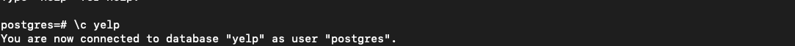
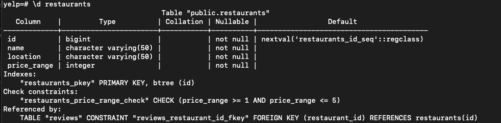
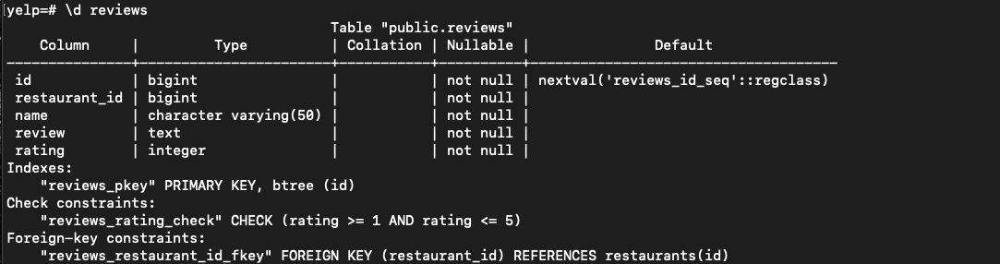
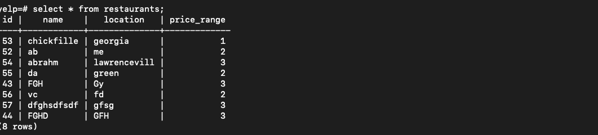
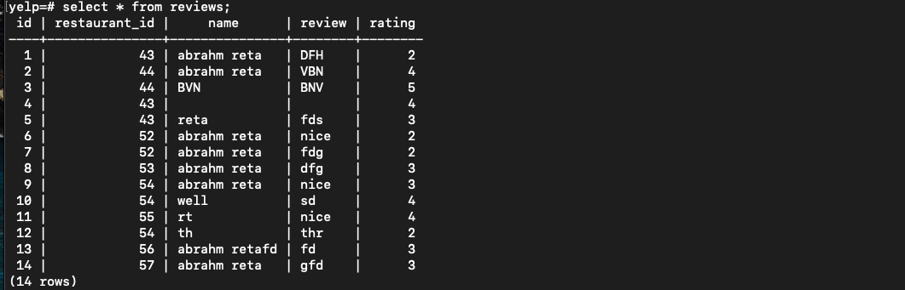

This is a Yelp app that allows others to find restaurants in different cities, as well as their ratings.

- $ npm install -g npx
- $ npx create-react-app

- $ mkdir pg-api && cd pg-api
- $ npm init -y
- $ touch server.js
- $ npm install --save body-parser morgan pg express cors

---

# PostgreSQL

Create database using psql powershell and connect with the database

**create database**

- $ psql
  postgres=# create database;
  CREATE DATABASE

**Connect with database**
postgres=# \c ;

**Connect with restaurant table**

**Connect with review table**!

**Select from restaurants table**!

**Select from review table**!

